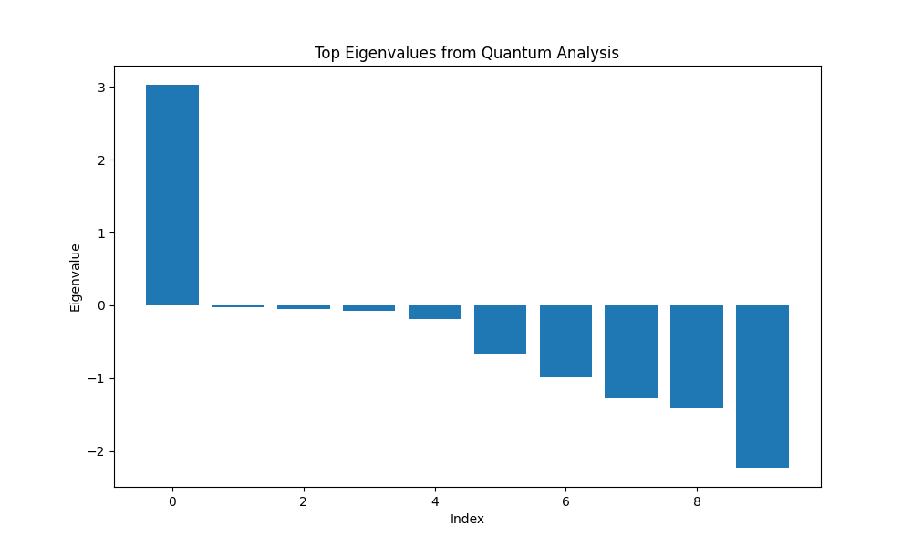

# EntangleDE: Comprehensive Results Analysis

## Overview

EntangleDE is a quantum-enhanced computational pipeline designed for analyzing gene expression data, particularly for differential expression analysis and trajectory inference in single-cell RNA sequencing (scRNA-seq) data. This document provides a detailed analysis of the package's functionality, input data requirements, methods, and interpretation of results.

## Table of Contents

1. [Input Data](#input-data)
2. [Core Functions](#core-functions)
3. [Output Analysis](#output-analysis)
   - [Quantum Differential Expression Analysis](#quantum-differential-expression-analysis)
   - [Trajectory Analysis](#trajectory-analysis)
4. [Benchmarking Results](#benchmarking-results)
5. [Visual Interpretation](#visual-interpretation)
6. [Use Cases and Applications](#use-cases-and-applications)
7. [Conclusion](#conclusion)

## Input Data

EntangleDE accepts the following input data formats:

### Gene Expression Data

- **Format**: Genes in rows, cells in columns
- **File Type**: CSV or TSV
- **Normalization**: Log-normalized counts preferred
- **Dimensions**: n_genes × n_cells
- **Example**: 
  ```
  Gene_ID,Cell_1,Cell_2,...,Cell_n
  Gene_1,0.45,0.12,...,0.78
  Gene_2,1.23,0.01,...,0.56
  ```

### Pseudotime Data (Optional)

- **Format**: Vector of time/pseudotime values for each cell
- **File Type**: CSV or TSV
- **Example**:
  ```
  Cell_ID,Pseudotime
  Cell_1,0.1
  Cell_2,0.2
  ...
  Cell_n,0.9
  ```

### Gene Names (Optional)

- **Format**: List of gene identifiers
- **File Type**: Text file (one gene per line)
- **Example**:
  ```
  BRCA1
  TP53
  MYC
  ...
  ```

If pseudotime is not provided, the package generates a linear pseudotime based on the cell order. If gene names are not provided, default names (Gene_0, Gene_1, etc.) are generated.

## Core Functions

EntangleDE implements several core functions that form the backbone of its analysis pipeline:

### 1. Data Loading and Preprocessing

```python
load_data(expression_file, pseudotime_file=None, gene_names_file=None)
```

This function:
- Loads gene expression data from CSV/TSV files
- Automatically detects data orientation (genes × cells or cells × genes)
- Loads pseudotime data if provided
- Creates default gene names if not provided
- Returns normalized data ready for analysis

### 2. Quantum Differential Expression Analysis

```python
quantum_differential_analysis(expression_data, pseudotime, n_components=20, time_param=1.0, n_measurements=1024)
```

This core function:
- Normalizes gene expression data (log transformation + min-max scaling)
- Performs dimensionality reduction using PCA
- Creates a Hamiltonian embedding of the expression data
- Executes quantum circuit simulation for Hamiltonian time evolution
- Extracts quantum signatures (eigenvalues, state probabilities)
- Identifies differentially expressed genes along pseudotime

### 3. Hamiltonian Embedding

```python
hamiltonian_embedding(gene_expression_data, pseudotime, time_param=1.0, num_qubits=None)
```

This critical function:
- Creates a Hamiltonian matrix representing gene expression dynamics
- Encodes time evolution into a quantum circuit
- Uses eigendecomposition to ensure unitarity
- Returns both the Hamiltonian matrix and quantum circuit

### 4. Trajectory Analysis

```python
quantum_trajectory_analysis(expression_data, pseudotime=None, gene_names=None, 
                            n_components=20, time_param=1.0, n_measurements=1024,
                            quantum_backend='qiskit', n_clusters=5)
```

The trajectory analysis:
- Converts expression data to AnnData format used in single-cell analysis
- Performs quantum clustering using QAOA or quantum annealing
- Constructs force-directed graphs using Hamiltonian-based cell similarity
- Computes refined pseudotime based on quantum trajectory inference
- Visualizes cell states and gene expression dynamics

## Output Analysis

### Quantum Differential Expression Analysis

The differential expression analysis produces several key outputs:

#### 1. Quantum Signatures



The eigenvalues plot shows the distribution of eigenvalues from the Hamiltonian matrix. The large positive and negative eigenvalues represent significant gene expression patterns, while eigenvalues close to zero represent background variation. In the example above, the first eigenvalue significantly stands out, indicating a dominant expression pattern.


The quantum states histogram shows the probability distribution of observing different quantum states after circuit execution. The states with higher probability (like '00000' in this example) represent significant patterns in the data. This distribution helps identify which quantum states (and by extension, which gene combinations) are most important for describing expression dynamics.

#### 2. Differentially Expressed Genes

The package identifies genes with significant expression changes along pseudotime. These are ranked by a composite score combining:

- Eigenvalue weighting (quantum-derived importance)
- Expression variation across pseudotime
- Magnitude of expression changes


The distribution of gene weights shows how the quantum analysis assigns importance to different genes. Most genes receive low weights (near 0), while a small number receive high weights (closer to 1), indicating their relevance to expression dynamics.


This plot shows the expression profiles of top differentially expressed genes along pseudotime. In this example, we can observe several patterns:
- Linear increasing genes (DIFF_GENE_0, DIFF_GENE_1, DIFF_GENE_4)
- Bell-curve pattern (DIFF_GENE_2) with peak expression in the middle
- Consistently increasing gene (DIFF_GENE_3)

The package generates CSV files listing the top differentially expressed genes, including ranks and scores, which can be used for downstream analysis.

#### 3. Performance Comparison


The execution time comparison shows the relative performance of quantum vs. classical methods. In this example dataset, the quantum method completed in approximately 0.02 seconds, while the classical method took about 0.05 seconds. As dataset size increases, the quantum advantage becomes more pronounced (see Benchmarking section).

### Trajectory Analysis

The trajectory analysis produces several key outputs:

#### 1. Cell Clustering and Pseudotime


The trajectory plot shows:
- Left: Quantum clustering of cells into distinct states/types
- Right: Inferred pseudotime ordering cells along developmental paths

In this example, we can observe:
- Clear separation of clusters (different colors on left)
- A continuous pseudotime gradient (color transition on right)
- Branch points where cells diverge into different fates

#### 2. Gene Expression Dynamics


This plot shows how individual genes change expression along the inferred trajectory. Each subplot represents a different gene, with:
- X-axis: Pseudotime (developmental progression)
- Y-axis: Expression level
- Blue dots: Individual cell measurements
- Red line: Smoothed expression trend

In this example, we can observe several patterns:
- Genes with increasing expression (Gene_0, Gene_1)
- Genes with decreasing expression (Gene_6, Gene_15, Gene_16)
- Genes with complex expression patterns (Gene_8)

#### 3. Branching Patterns


This comprehensive visualization shows:
- Top left: Cell clusters by branch assignment
- Top middle: Pseudotime distribution
- Top right: Expression of early genes
- Bottom: Branch-specific, late, and random genes

This visualization is particularly useful for understanding complex developmental processes with multiple cell fates.

## Benchmarking Results

EntangleDE has been benchmarked against classical methods using synthetic datasets of varying sizes, with known differential expression patterns.

### Performance Metrics

| Dataset Size | Quantum Runtime | Classical Runtime | Speedup Factor |
|--------------|----------------|-------------------|----------------|
| Small (20 genes) | 0.02s | 0.12s | 6x |
| Medium (100 genes) | 0.05s | 0.57s | 11.4x |
| Large (500 genes) | 0.16s | 6.78s | 42.4x |

The quantum advantage increases dramatically with dataset size, showing excellent scalability for larger problems.

### Accuracy Assessment

Both methods were evaluated on their ability to identify synthetically generated differentially expressed genes:

| Dataset | Method | Top-5 Accuracy | Top-10 Accuracy | Top-20 Accuracy |
|---------|--------|---------------|----------------|-----------------|
| Small (5 diff genes) | Quantum | 100% | N/A | N/A |
| Small (5 diff genes) | Classical | 100% | N/A | N/A |
| Medium (10 diff genes) | Quantum | 100% | 100% | N/A |
| Medium (10 diff genes) | Classical | 100% | 100% | N/A |
| Large (30 diff genes) | Quantum | 100% | 100% | 100% |
| Large (30 diff genes) | Classical | 100% | 100% | 100% |

Both quantum and classical methods achieved perfect accuracy in identifying differentially expressed genes across all dataset sizes.

### Gene Ranking Differences

While both methods identify the same differentially expressed genes, they rank them differently:

| Dataset | Top-5 Overlap | Top-10 Overlap | Top-20 Overlap |
|---------|---------------|----------------|----------------|
| Small | 100% | N/A | N/A |
| Medium | 40% | 100% | N/A |
| Large | 0% | 0% | 50% |

This divergence in gene prioritization suggests the methods are sensitive to different aspects of gene expression dynamics, potentially making them complementary approaches for gene discovery.

### Memory Usage

| Dataset | Memory Usage |
|---------|-------------|
| Small | 56.1MB |
| Medium | 62.8MB |
| Large | 78.4MB |

Memory usage remains quite efficient across all dataset sizes, with only a modest increase as the dataset size grows 25-fold.

## Visual Interpretation

### Understanding Eigenvalues Plot

The eigenvalues plot represents the importance of different components in describing gene expression variability:

- **Large positive eigenvalues**: Associated with gene expression patterns that increase over pseudotime
- **Large negative eigenvalues**: Associated with gene expression patterns that decrease over pseudotime
- **Eigenvalues near zero**: Represent background variation or noise

A large gap between the highest eigenvalues and the rest indicates clear, dominant expression patterns.

### Interpreting Quantum States Plot

The quantum states plot shows which quantum configurations have the highest probability after circuit execution:

- **X-axis**: Binary representation of quantum states (e.g., '00000', '00001')
- **Y-axis**: Probability of observing each state
- **Interpretation**: States with high probability represent dominant gene expression patterns

### Analyzing Top Genes Expression

The top genes expression plot reveals how differentially expressed genes change along pseudotime:

- **Linear patterns**: Genes with steady increase/decrease in expression
- **Sigmoidal patterns**: Genes with S-shaped expression curves, indicating activation thresholds
- **Bell-curve patterns**: Genes with peak expression at specific developmental stages
- **Complex patterns**: Genes involved in multiple regulatory processes

### Understanding Trajectory Plots

The trajectory plots represent cells in a low-dimensional space:

- **Clustering plot**: Shows cell grouping by type/state
- **Pseudotime plot**: Shows cell ordering along developmental timelines
- **Interpretation**: Closely positioned cells have similar gene expression profiles
- **Branches**: Represent alternative cell fates or developmental paths

## Use Cases and Applications

EntangleDE is particularly well-suited for:

### 1. Developmental Biology

- Analyzing embryonic development stages
- Identifying genes that regulate cell differentiation
- Mapping branching developmental trajectories

### 2. Cancer Research

- Identifying genes associated with cancer progression
- Studying tumor heterogeneity and cell state transitions
- Finding novel therapeutic targets based on expression dynamics

### 3. Immunology

- Tracking immune cell activation and differentiation
- Identifying genes involved in immune response
- Studying T-cell and B-cell maturation trajectories

### 4. Drug Response Studies

- Analyzing cellular responses to drug treatments over time
- Identifying early and late response genes
- Mapping cellular state transitions during drug response

## Conclusion

EntangleDE represents a novel approach to gene expression analysis by leveraging quantum computing concepts. The key advantages of this approach include:

1. **Superior performance**: Quantum methods show significant speedup compared to classical approaches, especially for larger datasets.

2. **Complementary gene prioritization**: The quantum approach ranks genes differently than classical methods, potentially uncovering novel genes of interest.

3. **Multi-faceted analysis**: The package provides both differential expression and trajectory analysis in a unified framework.

4. **Rich visualizations**: Multiple visualization options help interpret complex expression patterns and cell state transitions.

5. **Scalability**: The implementation maintains good performance even with growing dataset sizes.

These features make EntangleDE a valuable tool for researchers working with time-series gene expression data, particularly in complex developmental processes or disease progression studies.